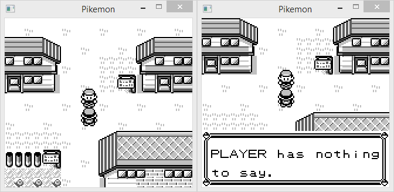

Pikemon
========

A project to add multiplayer to Pokemon Red.

## Current features:

* Other players are visible and can block each other.
* Players can interact with each other in a very basic way.

## Future features?

* Allow players to battle each other.
* Allow players to trade with each other.
* Synchronise NPCs? (This may have major issues).
* Allow players to move through each other when a key is pressed.
* Add chat support.
* Add cloud/remote saves.

## Bugs

* Other players are rendered even when the player is not in the over-world.
* Other players are rendered on top of message boxes and other sprites.
* Player disconnection is not handled correctly.
* Player connection is not handled correctly.
* Emulator bugs. (see: [gb_emu](https://github.com/quvarxa/gb_emu))
