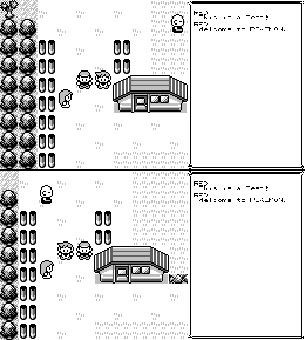

Pikemon
========

A project to add multiplayer to Pokemon Red.

## Current features:

* Other players are visible on the overworld.
* Collision between players.
* In game chat support.
* Battle the other player's party by talking to them.

## Future features?

* Allow players to directly battle each other.
* Allow players to trade with each other.
* Synchronise NPCs? (This may have major issues).
* Allow players to move through each other when a key is pressed.
* Add cloud/remote saves.
* Server configuration, (e.g. allow fast mode, forced nuzlocke challenge)

## Bugs

* Need restrictions for interacting with players without pokemon.
* Players that are on different map ids cannot see each other, even if they are within viewing distance.
* Emulator bugs. (see: [gb_emu](https://github.com/quvarxa/gb_emu))
